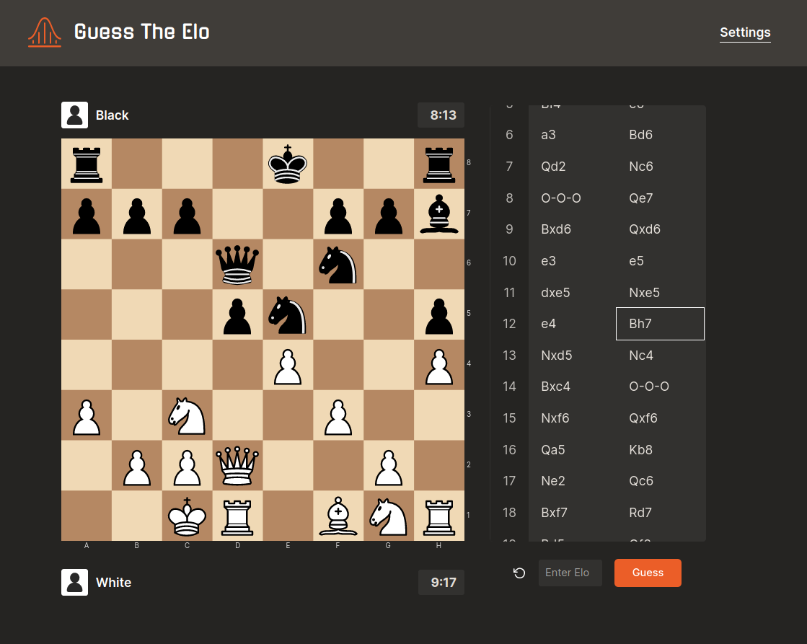
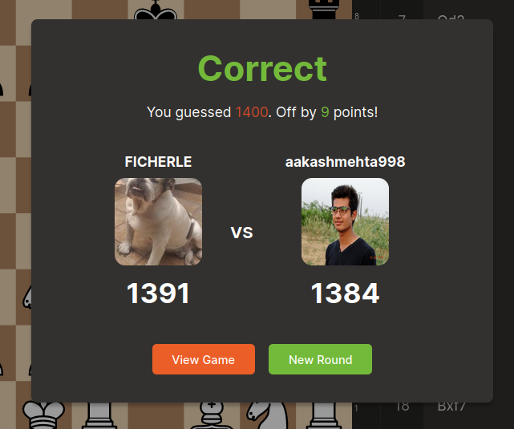

# Guess The Elo

GTE is a fun challenge where the aim is to guess a player's elo by analyzing a game that they've played. The game idea was created by Gotham Chess,
who has an entertaining series of videos playing GTE. This project was built in order to allow anyone to try playing GTE themselves.

It selects a random chess.com game based on your GTE preferences and your goal can either be to guess either white or black's elo or the average between both.

